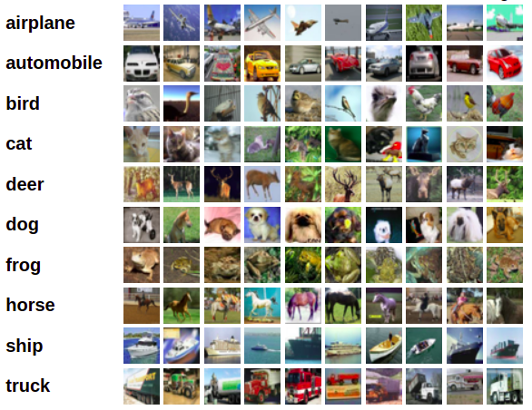
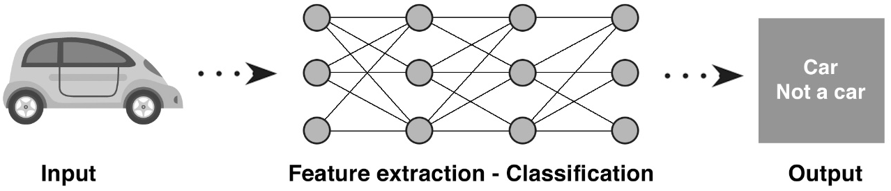
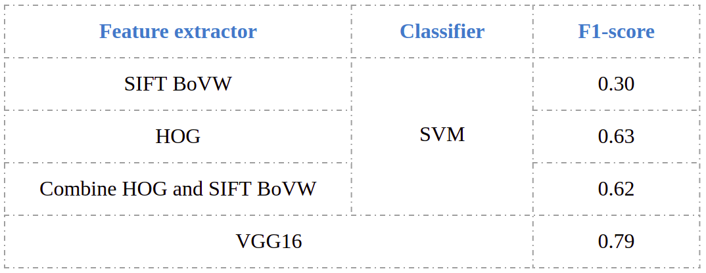

## Introduction
## Dataset
- The CIFAR-10 dataset consists of 60000 32x32 colour images in 10 classes, with 6000 images per class. There are 50000 training images and 10000 test images. Here are the classes in the dataset, as well as 10 random images from each:

    
  
## Methodology

    
  
- In extracting feature stage, we used HOG and BoVW. Then, using SVM classifier to classify images base on feature vectors of images.
- In another method, we used VGG16 model and finetune it on the CIFAR-10 dataset. This also is the method that give the best result.
  
## Comparison
 

    
